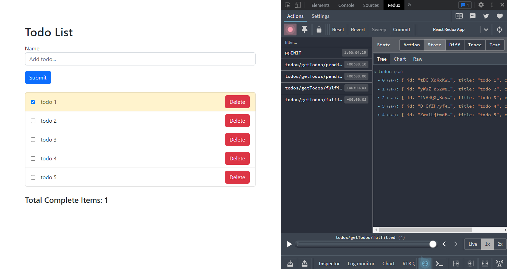

# Todo App | Redux Toolkit Project

This project was bootstrapped with [Create React App](https://github.com/facebook/create-react-app), using the [Redux](https://redux.js.org/) and [Redux Toolkit](https://redux-toolkit.js.org/) template.


## Description

A small scale todo app as part of a deep dive into `redux-toolkit`.


### :gear: Tech Stack

   1. React - Frontend
   2. Bootstrap 5 - via cdn
   3. [Redux Toolkit (RTK)](https://redux-toolkit.js.org/introduction/getting-started) - for writing Redux logic / state management
   4. Redux Thunk from RTK - async middleware for doing the API calls
   5. [Redux Devtools for Chrome](https://chrome.google.com/webstore/detail/redux-devtools/lmhkpmbekcpmknklioeibfkpmmfibljd?hl=en)
   6. Express - Backend API server framework
   7. Nodemon - Utility to auto restart express server


## Usage
Download ZIP or clone the source code repo to your system. Includes:
   * React frontend - client
   * API 'backend' - server

### API 'Backend'

1. Set up API
     - `ctrl-~` to open terminal in VS Code
     - `cd server`
     - `npm i` to install dependencies
2. Start the API
     - `npm run server` to start locally
3. Test the API
     Verify server is running in the browser:
     ```
     http://localhost:7000/todos
     ```
     Test with Postman
     GET
     ```
    localhost:7000/todos
     ```
     POST > body > raw > JSON:
     ```
    { "title" : "this is a new todo." }
     ```

   **NOTES**
      - API must be running to test if your frontened is working as intended.
      - This API is a mock mode.js/express server for testing purposes

### Frontend
Once your server is running, you need to set up the React frontend:

1. Set up frontend
     - Open another terminal (or split terminal) in VS Code
     - `cd client`
     - `npm i` to install dependencies
2. Start the client
     - `npm start` to run on localhost:3000
3. Your frontend should initially be populated with the mock server data. It should look similar to this:

<p align="center">
  
</p>

## Resources
[React RTK Tutorial by Chris Blakely](https://www.youtube.com/watch?v=fiesH6WU63I)